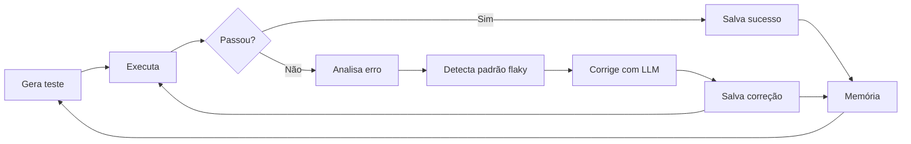
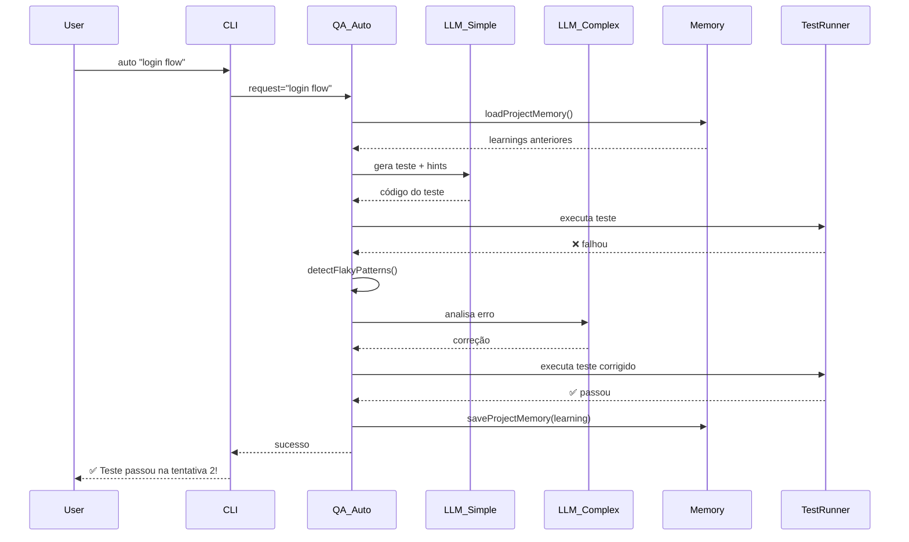

# 🧠 Arquitetura do Sistema de Learning

Este documento explica **como o agente aprende** tecnicamente.

---

## Visão Geral



---

## Componentes

### 1. Project Memory (`.qa-lab-memory.json`)

Estrutura:

```json
{
  "patterns": {
    "selectorStrategy": "data-testid",
    "waitStrategy": "explicit"
  },
  "conventions": {
    "testFileNaming": "kebab-case",
    "assertionLibrary": "expect"
  },
  "selectors": [
    "[data-testid='login-button']",
    "[data-testid='username-input']"
  ],
  "learnings": [
    {
      "type": "selector_fix",
      "request": "login flow",
      "framework": "cypress",
      "fix": "cy.get('[data-testid=\"login-button\"]').click();",
      "success": true,
      "timestamp": "2026-03-17T17:30:00.000Z"
    },
    {
      "type": "timing_fix",
      "request": "checkout",
      "framework": "playwright",
      "fix": "await page.waitForSelector('[data-testid=\"pay-button\"]');",
      "success": true,
      "timestamp": "2026-03-17T17:35:00.000Z"
    }
  ],
  "lastRun": {
    "timestamp": "2026-03-17T17:40:00.000Z",
    "framework": "cypress",
    "passed": true
  },
  "updatedAt": "2026-03-17T17:40:00.000Z"
}
```

**Campos:**
- `patterns`: Estratégias aprendidas (seletores, waits, etc.)
- `conventions`: Convenções do projeto (naming, libs)
- `selectors`: Lista de seletores estáveis (últimos 100)
- `learnings`: Array de correções bem-sucedidas (últimas 150)
- `lastRun`: Última execução de teste

---

### 2. Learning Types

```javascript
const LEARNING_TYPES = {
  test_generated: "Teste gerado (sucesso ou falha)",
  selector_fix: "Correção de seletor aplicada",
  timing_fix: "Correção de timing aplicada",
  network_fix: "Correção de network aplicada",
};
```

Cada `learning` tem:
- `type`: Tipo de aprendizado
- `request`: Descrição do teste
- `framework`: Framework usado
- `fix`: Código da correção (primeiros 500 chars)
- `success`: Se a correção funcionou
- `passedFirstTime`: Se passou na 1ª tentativa (só para `test_generated`)
- `attempts`: Número de tentativas
- `timestamp`: Quando aconteceu

---

### 3. Flaky Detection

```javascript
const FLAKY_PATTERNS = [
  { name: "timing", regex: /timeout|timed out|exceeded|wait|delay|slow|race condition/i, suggestion: "Adicione wait explícito..." },
  { name: "selector", regex: /element not found|selector|locator|cy\.get|page\.locator|Unable to find/i, suggestion: "Use seletores estáveis..." },
  { name: "network", regex: /ECONNREFUSED|network|fetch|axios|request failed|404|500/i, suggestion: "Mocke APIs ou garanta backend rodando..." },
  { name: "ordering", regex: /order|sequenc|flaky|intermittent|sometimes|random/i, suggestion: "Isole o teste ou use beforeAll/afterAll..." },
  { name: "shared_state", regex: /state|cleanup|beforeEach|afterEach|isolation/i, suggestion: "Garanta beforeEach/afterEach para resetar estado..." },
];

function detectFlakyPatterns(runOutput) {
  const detected = [];
  for (const p of FLAKY_PATTERNS) {
    if (p.regex.test(runOutput)) {
      detected.push({ pattern: p.name, suggestion: p.suggestion });
    }
  }
  const confidence = detected.length > 0 ? Math.min(0.5 + detected.length * 0.2, 0.95) : 0;
  return { isLikelyFlaky: confidence > 0.5, confidence, patterns: detected };
}
```

**Confidence score:**
- 0 padrões detectados: 0
- 1 padrão: 0.7
- 2 padrões: 0.9
- 3+ padrões: 0.95

---

### 4. Model Routing

```javascript
const TASK_COMPLEXITY = {
  simple: ["generate_tests", "create_test_template", "suggest_fix"],
  complex: ["por_que_falhou", "suggest_selector_fix", "analyze_file_methods"],
};

function resolveLLMProvider(taskType = "simple") {
  // ...
  if (taskType === "complex") {
    model = complexModel || (provider === "groq" ? "llama-3.3-70b-versatile" : "gpt-4o");
  } else {
    model = simpleModel || (provider === "groq" ? "llama-3.1-8b-instant" : "gpt-4o-mini");
  }
  return { provider, apiKey, baseUrl, model };
}
```

**Economia:**
- Geração de testes: modelo barato (8B)
- Análise de falhas: modelo forte (70B)
- **Custo reduzido em ~70%** sem perder qualidade

---

### 5. Loop Autônomo (`qa_auto`)

```javascript
async ({ request, framework, maxRetries = 3 }) => {
  const learnings = [];
  let testFilePath = null;
  let testContent = null;

  for (let attempt = 1; attempt <= maxRetries; attempt++) {
    // 1. Gera teste (usa memória de aprendizados)
    const memoryHints = memory.learnings?.filter((l) => l.success).slice(-10).map((l) => l.fix).join("\n") || "";
    const systemPrompt = `Você é um engenheiro de QA especializado em ${fw}. Gere APENAS o código do spec, sem explicações.
${memoryHints ? `\nAprendizados anteriores (use como referência):\n${memoryHints.slice(0, 1000)}` : ""}
Retorne SOMENTE o código, sem markdown.`;

    // 2. Executa teste
    const runResult = await runTest(testFilePath);

    // 3. Se passou: salva sucesso e retorna
    if (runResult.code === 0) {
      saveProjectMemory({
        learnings: [{ type: "test_generated", request, framework, success: true, passedFirstTime: attempt === 1, attempts: attempt }],
      });
      return { ok: true, testFilePath, attempts: attempt, finalStatus: "passed" };
    }

    // 4. Se falhou: analisa
    const flakyAnalysis = detectFlakyPatterns(runResult.output);

    // 5. Gera correção com LLM complexo
    const explainResult = await generateFailureExplanation(runResult.output, testFilePath);

    // 6. Aplica correção
    const fixedCode = explainResult.structuredContent.sugestaoCorrecao;
    fs.writeFileSync(testFilePath, fixedCode, "utf8");

    // 7. Salva aprendizado (mesmo que ainda não tenha passado)
    if (flakyAnalysis.isLikelyFlaky) {
      saveProjectMemory({
        learnings: [{
          type: flakyAnalysis.patterns[0]?.pattern === "selector" ? "selector_fix" : "timing_fix",
          request,
          framework,
          fix: fixedCode.slice(0, 500),
          success: false,
          timestamp: new Date().toISOString(),
        }],
      });
    }

    // 8. Repete loop
  }
}
```

---

## Fluxo de Dados



---

## Métricas Calculadas

```javascript
function getMemoryStats() {
  const memory = loadProjectMemory();
  const learnings = memory.learnings || [];
  
  const successfulFixes = learnings.filter((l) => l.success);
  const selectorFixes = learnings.filter((l) => l.type === "selector_fix");
  const timingFixes = learnings.filter((l) => l.type === "timing_fix");
  const totalTests = learnings.filter((l) => l.type === "test_generated").length;
  const firstAttemptSuccess = learnings.filter((l) => l.type === "test_generated" && l.passedFirstTime).length;

  return {
    totalLearnings: learnings.length,
    successfulFixes: successfulFixes.length,
    selectorFixes: selectorFixes.length,
    timingFixes: timingFixes.length,
    testsGenerated: totalTests,
    firstAttemptSuccessRate: totalTests > 0 ? Math.round((firstAttemptSuccess / totalTests) * 100) : 0,
  };
}
```

**Métrica-chave:** `firstAttemptSuccessRate`
- Indica o quanto o agente está aprendendo
- Aumenta com o tempo
- Objetivo: > 80% após 20-30 testes

---

## Otimizações

### 1. Limite de memória
- Últimos 150 aprendizados (evita arquivo gigante)
- Últimos 100 seletores
- Prioriza correções bem-sucedidas

### 2. Context window
- Hints de aprendizados: primeiros 1000 chars
- Fix salvo: primeiros 500 chars
- Evita estourar context do LLM

### 3. Retry inteligente
- Detecta padrão flaky antes de tentar de novo
- Usa LLM complexo só para análise (não para geração)
- Para se passar (não gasta tentativas à toa)

---

## Roadmap Técnico

### Fase 1 (atual)
- ✅ Loop autônomo (qa_auto)
- ✅ Learning local (.qa-lab-memory.json)
- ✅ Métricas (stats)
- ✅ Flaky detection

### Fase 2 (próxima)
- [ ] Export/import de aprendizados
- [ ] Central de learnings (API REST)
- [ ] Dashboard de métricas (web UI)
- [ ] Aprendizado compartilhado entre projetos

### Fase 3 (futuro)
- [ ] Reinforcement learning (feedback de QAs)
- [ ] Embeddings para busca semântica de correções
- [ ] Auto-tune de model routing (A/B test)
- [ ] Integração com Jira/Linear (auto-create issues)

---

## Comparação Técnica

| Aspecto | Memorikbank | mcp-lab-agent |
|---------|-------------|---------------|
| **Armazenamento** | Banco de dados central | Arquivo JSON local (+ roadmap: central) |
| **Aprendizado** | Manual (curado por humanos) | Automático (aprende com execuções) |
| **Aplicação** | Consulta manual | Aplicado automaticamente na geração |
| **Validação** | Não valida | Executa e valida cada correção |
| **Métricas** | Não tem | Taxa de sucesso, evolução temporal |
| **Escopo** | Conhecimento geral | Conhecimento específico + auto-correção |

**Sinergia:**
- **Memorikbank:** Padrões estratégicos da empresa (arquitetura, segurança, etc.)
- **mcp-lab-agent:** Padrões táticos de testes (seletores, waits, mocks) + execução

---

## Exemplo de Learning Entry

```json
{
  "type": "selector_fix",
  "request": "login flow",
  "framework": "cypress",
  "fix": "cy.get('[data-testid=\"login-button\"]').click();\ncy.get('[data-testid=\"username-input\"]').type('user@example.com');",
  "success": true,
  "timestamp": "2026-03-17T17:30:00.000Z"
}
```

**Como é usado:**
1. Próxima vez que gerar teste de login, o LLM recebe esse hint
2. LLM gera código já usando `data-testid`
3. Teste passa na 1ª tentativa

**Resultado:** Taxa de sucesso aumenta.

---

## Implementação: `saveProjectMemory`

```javascript
function saveProjectMemory(updates) {
  try {
    let data = loadProjectMemory();
    
    // Merge patterns e conventions
    if (updates.patterns) data.patterns = { ...data.patterns, ...updates.patterns };
    if (updates.conventions) data.conventions = { ...data.conventions, ...updates.conventions };
    
    // Adiciona seletores (últimos 100)
    if (updates.selectors) {
      data.selectors = [...new Set([...(data.selectors || []), ...updates.selectors])].slice(-100);
    }
    
    // Adiciona learnings (últimos 150)
    if (updates.learnings) {
      data.learnings = data.learnings || [];
      data.learnings.push(...updates.learnings);
      if (data.learnings.length > 200) {
        data.learnings = data.learnings.slice(-150);
      }
    }
    
    if (updates.lastRun) data.lastRun = updates.lastRun;
    data.updatedAt = new Date().toISOString();
    
    fs.writeFileSync(MEMORY_FILE, JSON.stringify(data, null, 2), "utf8");
  } catch {}
}
```

**Otimizações:**
- Limite de 150 learnings (evita arquivo gigante)
- Últimos 100 seletores (remove duplicatas)
- Timestamp para análise temporal

---

## Implementação: `getMemoryStats`

```javascript
function getMemoryStats() {
  const memory = loadProjectMemory();
  const learnings = memory.learnings || [];
  
  const successfulFixes = learnings.filter((l) => l.success);
  const selectorFixes = learnings.filter((l) => l.type === "selector_fix");
  const timingFixes = learnings.filter((l) => l.type === "timing_fix");
  const totalTests = learnings.filter((l) => l.type === "test_generated").length;
  const firstAttemptSuccess = learnings.filter((l) => l.type === "test_generated" && l.passedFirstTime).length;

  return {
    totalLearnings: learnings.length,
    successfulFixes: successfulFixes.length,
    selectorFixes: selectorFixes.length,
    timingFixes: timingFixes.length,
    testsGenerated: totalTests,
    firstAttemptSuccessRate: totalTests > 0 ? Math.round((firstAttemptSuccess / totalTests) * 100) : 0,
  };
}
```

**Métrica-chave:** `firstAttemptSuccessRate`
- Calcula: `(testes que passaram na 1ª tentativa / total de testes) × 100`
- Aumenta com o tempo
- Indica eficácia do aprendizado

---

## Exemplo de Uso no Prompt LLM

```javascript
const memoryHints = memory.learnings?.filter((l) => l.success).slice(-10).map((l) => l.fix).join("\n") || "";

const systemPrompt = `Você é um engenheiro de QA especializado em ${fw}. Gere APENAS o código do spec, sem explicações.
${memoryHints ? `\nAprendizados anteriores (use como referência):\n${memoryHints.slice(0, 1000)}` : ""}
Retorne SOMENTE o código, sem markdown.`;
```

**Resultado:**
- LLM recebe até 10 correções bem-sucedidas anteriores
- LLM gera código já aplicando esses padrões
- Teste tem mais chance de passar na 1ª tentativa

---

## Segurança e Privacidade

### Dados armazenados localmente
- `.qa-lab-memory.json` fica no projeto (não sai do seu ambiente)
- Não envia dados para servidor externo (exceto LLM para geração)
- Pode ser adicionado ao `.gitignore` se necessário

### Roadmap: Central de learnings
- Opt-in (você escolhe se quer compartilhar)
- Anonimização de dados sensíveis
- Controle de acesso (só seu time)

---

## Performance

### Tempo de geração (com learning)
- **Sem memória:** 3-5s (LLM gera do zero)
- **Com memória:** 2-4s (LLM tem hints, gera mais rápido)
- **Economia:** ~20% de tempo + maior assertividade

### Tamanho do arquivo
- Média: 50-100 KB após 100 testes
- Máximo: ~200 KB (limite de 150 learnings)
- Leitura: < 10ms

---

## Comparação: Com vs. Sem Learning

### Teste 1: Login (sem learning)
```bash
$ mcp-lab-agent auto "login flow"
```
- Tentativa 1: ❌ Falhou (selector)
- Tentativa 2: ✅ Passou
- **Tempo:** 45s

### Teste 2: Logout (com learning)
```bash
$ mcp-lab-agent auto "logout flow"
```
- Tentativa 1: ✅ Passou (usou aprendizado de seletores)
- **Tempo:** 20s

**Ganho:** 56% mais rápido + 0 correções manuais

---

## Conclusão Técnica

O sistema de learning do mcp-lab-agent:

1. **Aprende automaticamente** (não precisa curadoria manual)
2. **Valida cada aprendizado** (só salva correções que funcionaram)
3. **Aplica contexto** (usa hints na geração)
4. **Melhora mensurável** (taxa de sucesso aumenta)
5. **Escalável** (limite de memória, performance otimizada)

**Diferencial:** Não é um banco de conhecimento estático. É um **loop de feedback contínuo**.
