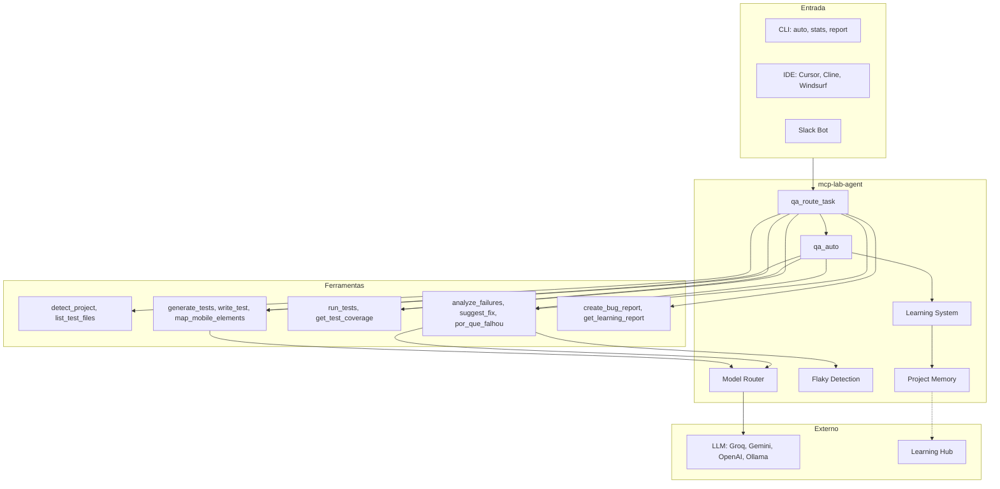

# mcp-lab-agent

[](https://www.npmjs.com/package/mcp-lab-agent)
[](https://nodejs.org)
[](LICENSE)

**PT-BR** | [English](#english)

---

## Português (PT-BR)

**Sistema de QA autônomo com IA.** Reduz tempo de debug de testes, elimina flaky e mantém seletores estáveis — com um sistema de aprendizado que melhora a cada correção.

> **TL;DR para recrutadores:** QA autônomo que explica *por que* os testes falharam em linguagem clara e aplica correções automaticamente. Testes que se autocorrigem e aprendem a cada fix. Integra com IDE (Cursor) e Slack. Feito para QA Engineers, SDETs e roles de Automação/IA.

### Por que isso importa

| Problema real | Impacto no mercado | O que o mcp-lab-agent faz |
|---------------|--------------------|---------------------------|
| **Testes flaky** | Times gastam 5–10h/semana. Microsoft: ~25% das falhas em CI são flaky; Slack tinha 56% antes de remediar. | Detecta padrões flaky, sugere correções, retry automático com fixes |
| **"Por que falhou?"** | QAs e devs perdem horas lendo stack traces e logs. "Teste falhou" genérico não ajuda. | **Causa + correção em 30 segundos.** Diagnóstico em linguagem clara: o que aconteceu, por que e como corrigir |
| **Seletores quebrados** | Refactors de UI quebram testes. Seletores frágeis (classes CSS, XPath longo) exigem manutenção manual. | Auto-fix de seletores, sugere `data-testid`, aplica correções e tenta de novo |

### O WOW: Testes que se autocorrigem e aprendem

**Quando um teste falha, você recebe a causa e a correção em 30 segundos. Sem cavar em stack traces.**

Cada correção bem-sucedida é salva e reutilizada. Na próxima falha similar, o agente aplica o padrão aprendido automaticamente. **A taxa de sucesso na primeira tentativa melhora ao longo do tempo** — mensurável via `mcp-lab-agent stats`.

```bash
npx mcp-lab-agent auto "login flow" --max-retries 5
```

*Um comando. Análise completa. Autocorreção. Aprendizado.*

### Principais resultados

- **Reduz tempo de debug** — "Por que falhou?" em linguagem clara, não stack traces
- **Corta manutenção de flaky** — Detecção, diagnóstico e sugestões de correção
- **Escala QA sem escalar headcount** — Agente no IDE + Slack bot; funciona com Cypress, Playwright, Appium, Jest e 11+ frameworks
- **Pronto para enterprise** — Socket Mode (sem URL pública), Ollama (offline), Learning Hub para times

### Como funciona

**🤖 Agente no IDE (Cursor, Cline, Windsurf)** — Pergunte no chat: *"Gere teste para login"*, *"Por que o teste falhou?"*, *"Roda o teste X"*. O agente detecta o projeto, executa testes, analisa falhas, aplica correções e aprende.

**💬 Slack Bot** — Mencione o bot em qualquer canal — ele executa testes e posta o relatório. Funciona em ambiente corporativo (Socket Mode, sem ngrok). QA no fluxo da conversa.

### Para quem é

| Perfil | Benefício |
|--------|-----------|
| **QAs e SDETs** | Geração assistida de testes, análise de falhas com sugestões de correção, detecção de flaky |
| **Desenvolvedores** | "Por que falhou?" em segundos, análise de arquivos/métodos, integração direta no IDE |
| **Tech leads** | Visão de risco por área, métricas de estabilidade, relatórios para decisão |
| **Times** | Learning Hub, Slack bot para QA no chat, CI/CD, Ollama (offline) |

### Como é diferente

| Outras ferramentas | mcp-lab-agent |
|--------------------|---------------|
| Só executam testes | Executa, analisa causa, sugere fix, aplica correção |
| "Teste falhou" genérico | Linguagem clara: "Login falha 30% das vezes (timing). Adicione waitForDisplayed." |
| Sem memória entre execuções | Learning system: cada fix melhora as próximas gerações |
| Uma ferramenta por tarefa | End-to-end: gera, executa, analisa, reporta, aprende |

---

<a name="english"></a>

## English

**AI-powered autonomous QA system.** Reduces test debugging time, eliminates flaky tests, and keeps selectors stable — with a learning system that gets smarter with every fix.

> **TL;DR for recruiters:** Autonomous QA that explains *why* tests fail in plain language and applies fixes automatically. Self-healing tests that learn from each fix. Integrates with IDE (Cursor) and Slack. Built for QA Engineers, SDETs, and AI/Automation roles.

### Why this matters

| Real problem | Industry impact | What mcp-lab-agent does |
|--------------|-----------------|-------------------------|
| **Flaky tests** | Teams spend 5–10h/week. Microsoft: ~25% of CI failures are flaky; Slack had 56% before remediation. | Detects flaky patterns, suggests fixes, auto-retries with corrections |
| **"Why did it fail?"** | QAs and devs lose hours reading stack traces and logs. Generic "test failed" doesn't help. | **Cause + fix in 30 seconds.** Plain-language diagnosis: what happened, why, and how to fix |
| **Broken selectors** | UI refactors break tests. Fragile selectors (CSS classes, long XPath) require manual maintenance. | Auto-fix selectors, suggests `data-testid`, applies corrections and retries |

### The WOW: Self-healing tests that learn

**When a test fails, you get the cause and fix in 30 seconds. No more digging through stack traces.**

Each successful fix is saved and reused. The next time a similar failure happens, the agent applies the learned pattern automatically. **First-attempt success rate improves over time** — measurable via `mcp-lab-agent stats`.

```bash
npx mcp-lab-agent auto "login flow" --max-retries 5
```

*One command. Full analysis. Self-correction. Learning.*

### Key outcomes

- **Reduce debugging time** — "Why did it fail?" in plain language, not stack traces
- **Cut flaky test maintenance** — Detection, diagnosis, and suggested fixes
- **Scale QA without scaling headcount** — IDE agent + Slack bot; works with Cypress, Playwright, Appium, Jest, and 11+ frameworks
- **Enterprise-ready** — Socket Mode (no public URL), Ollama (offline), Learning Hub for teams

### How it works

**🤖 IDE Agent (Cursor, Cline, Windsurf)** — Ask in chat: *"Generate a test for login"*, *"Why did the test fail?"*, *"Run test X"*. The agent detects your project, runs tests, analyzes failures, applies fixes, and learns.

**💬 Slack Bot** — Mention the bot in any channel — it runs tests and posts the report. Works in corporate environments (Socket Mode, no ngrok). QA in the flow of conversation.

### Who it's for

| Role | Benefit |
|------|---------|
| **QAs & SDETs** | Assisted test generation, failure analysis with fix suggestions, flaky detection |
| **Developers** | "Why did it fail?" in seconds, file/method analysis, direct IDE integration |
| **Tech leads** | Risk visibility by area, stability metrics, decision-ready reports |
| **Teams** | Learning Hub, Slack bot for QA in chat, CI/CD integration, Ollama (offline) |

### How it's different

| Other tools | mcp-lab-agent |
|-------------|---------------|
| Run tests only | Run, analyze cause, suggest fix, apply correction |
| Generic "test failed" | Plain-language: "Login fails 30% of the time (timing). Add waitForDisplayed." |
| No memory between runs | Learning system: each fix improves future generations |
| One tool per task | End-to-end: generate, run, analyze, report, learn |

---

## Learning System

**Como aprende:** O agente detecta o padrão de falha em cada execução (regex + contexto) e armazena a correção aplicada na memória. Nas próximas gerações, esses aprendizados são injetados no prompt do LLM e nas práticas obrigatórias.

**Baseado em quê:** Tipo de erro (classificado automaticamente), framework, trecho de correção e resultado (passou ou não).

**Melhora quanto:** Taxa de sucesso na primeira tentativa (%), rastreável em `mcp-lab-agent stats` e `get_learning_report`. Quanto mais correções bem-sucedidas, maior a tendência de os próximos testes passarem de primeira.

**Exemplos de padrões aprendidos:**

| Padrão detectado | Correção aplicada |
|------------------|-------------------|
| `element_not_visible` | `waitForDisplayed()`, `should('be.visible')` antes de interagir |
| `element_not_rendered` | `waitForSelector`, `waitFor({ state: 'attached' })` |
| `selector` instável | Sugestão de `data-testid`, `role`, seletores acessíveis |
| `timing` | Retry automático, waits explícitos, timeout ajustado |
| `element_stale` | Re-localizar elemento antes de cada ação |
| `mobile_mapping_invisible` | Mapeamento visível no topo do spec (Page Object) |

Cada correção bem-sucedida aumenta a taxa de sucesso futura.

---

## Quick Start

### CLI — Análise completa

```bash
# Análise completa: executa testes, analisa estabilidade, prevê riscos e recomenda ações
npx mcp-lab-agent analyze

# Modo autônomo: gera, roda, corrige e aprende (até passar ou max_retries)
npx mcp-lab-agent auto "login flow" --max-retries 5

# Métricas de aprendizado e taxa de sucesso
npx mcp-lab-agent stats

# Relatório de evolução com recomendações para aprimorar o código
npx mcp-lab-agent report --full
```

### IDE — Cursor, Cline, Windsurf

Adicione ao `~/.cursor/mcp.json`:

```json
{
  "mcpServers": {
    "qa-lab-agent": {
      "command": "npx",
      "args": ["-y", "mcp-lab-agent@latest"],
      "cwd": "${workspaceFolder}"
    }
  }
}
```

Use no chat: *"Detecte a estrutura do meu projeto"*, *"Gere teste para login"*, *"Por que o teste falhou?"*, *"Avalie http://localhost:3000 no browser"*.

**run_tests com device e auto-fix:** Ao pedir *"Roda o teste X"*, o agente detecta o device (de `qa-lab-agent.config.json`, `wdio.conf` ou `.detoxrc`), executa o fluxo e, se falhar por seletor, aplica correção automaticamente e tenta novamente.

### Slack Bot

```bash
npx mcp-lab-agent slack-bot
```

Funciona em ambiente corporativo (Socket Mode, sem URL pública). Configure `botToken` e `appToken` em `~/.cursor/mcp.json`. Onde obter: [slack-bot/CREDENTIALS.md](slack-bot/CREDENTIALS.md). Detalhes: [slack-bot/README.md](slack-bot/README.md).

### Learning Hub — Inteligência centralizada

```bash
npx mcp-lab-agent learning-hub
```

API e Dashboard em `http://localhost:3847`. Configure no `.env` do projeto:

```
LEARNING_HUB_URL=http://localhost:3847
LEARNING_HUB_PROJECT_ID=meu-projeto
```

O agente envia learnings automaticamente. O Hub agrega padrões e fornece recomendações. Detalhes: [learning-hub/README.md](learning-hub/README.md).

---

## Arquitetura



**Fluxo `qa_auto`:**
1. Detecta projeto (frameworks, pastas, fluxos)
2. Gera teste com LLM + memória de aprendizados
3. Executa o teste
4. Se falhar: analisa (flaky detection), corrige e tenta novamente
5. Aprende e salva correções na memória
6. Repete até passar ou atingir `max_retries`

---

## Capacidades

### Automação e geração

- **Modo autônomo** (`qa_auto`): gera, executa, analisa, corrige e aprende em loop
- **Geração com LLM**: Groq, Gemini, OpenAI ou Ollama (100% offline)
- **Mapeamento mobile** (`map_mobile_elements`): elementos em Appium/Detox
- **Templates**: waits inteligentes e assert final obrigatório em todo teste gerado

### Análise e diagnóstico

- **Detecção de falhas**: timing, selector, element_not_rendered, element_not_visible, element_stale, mobile_mapping_invisible
- **Mensagens contextualizadas**: cada tipo de erro tem explicação e sugestão específica
- **Análise de estabilidade**: taxa de falha por teste, identificação de flaky
- **Predição de flakiness** (`qa_predict_flaky`): risco antes de o problema aparecer
- **Análise de métodos** (`analyze_file_methods`): varredura por método do arquivo

### Relatórios e métricas

- **Bug reports** em Markdown
- **Métricas de negócio** (se `qa-lab-flows.json` configurado)
- **Relatório de evolução** (`get_learning_report`): padrões por tipo, recomendações
- **Benchmark** (`qa_compare_with_industry`): comparação com padrões do mercado

### Memória e Learning Hub

- **Memória local**: `.qa-lab-memory.json` por projeto
- **Learning Hub**: API central (`POST /learning`, `GET /patterns`), Dashboard, sync automático entre projetos

### Frameworks suportados

11+ frameworks: Cypress, Playwright, WebdriverIO, Jest, Vitest, Mocha, Robot Framework, pytest, Behave, Appium, Detox.

---

## CLI

| Comando | Descrição |
|---------|-----------|
| *(sem args)* | Inicia servidor MCP (modo IDE) |
| `learning-hub` | API + Dashboard (porta 3847) |
| `slack-bot` | Bot Slack (Socket Mode) |
| `analyze` | Análise completa do projeto |
| `auto <descrição> [--max-retries N]` | Modo autônomo (default: 3 tentativas) |
| `stats` | Estatísticas de aprendizado |
| `report [--full]` | Relatório de evolução |
| `detect [--json]` | Detecta frameworks e estrutura |
| `route <tarefa>` | Sugere ferramenta |
| `list` | Lista agentes e ferramentas |

```bash
# Exemplos de uso
mcp-lab-agent learning-hub          # Inicia Hub (porta 3847)
mcp-lab-agent analyze              # Análise completa
mcp-lab-agent auto "login flow"     # Modo autônomo
mcp-lab-agent stats                 # Taxa de sucesso, aprendizados
mcp-lab-agent report --full        # Relatório com recomendações
```

---

## Escalabilidade e uso em produção

- **Por projeto**: memória local (`.qa-lab-memory.json`) isolada por repositório
- **Entre times**: Learning Hub agrega padrões por `projectId`; Dashboard compartilhado
- **Entre empresas**: um Hub pode servir múltiplas organizações; padrões cross-org (ex.: "Playwright + selector instável" em 15 projetos) viram recomendações globais
- **CI/CD**: integração em GitHub Actions, GitLab CI, Jenkins
- **Métricas exportáveis**: JSON estruturado para Grafana, DataDog, dashboards internos
- **Ollama**: 100% offline; adequado para ambientes corporativos restritivos
- **LLM interno**: endpoint customizado da empresa

---

## Configuração

### Variáveis de ambiente (opcionais)

| Variável | Uso |
|----------|-----|
| `GROQ_API_KEY` | Groq |
| `GEMINI_API_KEY` | Google Gemini |
| `OPENAI_API_KEY` | OpenAI |
| `OLLAMA_BASE_URL` | Ollama (default: http://localhost:11434) |
| `QA_LAB_LLM_BASE_URL` | LLM customizado (empresa) |
| `QA_LAB_LLM_API_KEY` | API key do LLM |
| `QA_LAB_LLM_SIMPLE` | Modelo para tarefas simples |
| `QA_LAB_LLM_COMPLEX` | Modelo para tarefas complexas |
| `LEARNING_HUB_URL` | URL do Learning Hub |
| `LEARNING_HUB_PROJECT_ID` | ID do projeto no Hub |

### Ollama (offline)

```bash
brew install ollama
ollama pull llama3.1:8b
ollama serve
npx mcp-lab-agent auto "login flow"
```

### Modo browser (Playwright)

```bash
npm install playwright
```

---

## Documentação

- [CHANGELOG.md](CHANGELOG.md) — Histórico de versões
- [slack-bot/README.md](slack-bot/README.md) — Slack Bot
- [learning-hub/README.md](learning-hub/README.md) — Learning Hub
- [docs/PORTFOLIO_COPY_PT-BR.md](docs/PORTFOLIO_COPY_PT-BR.md) — Copy em PT-BR para portfólio (Vercel)

---

## Desenvolvimento

```bash
git clone https://github.com/Wesley-Gomes93/mcp-lab-agent
cd mcp-lab-agent
npm install
npm run build
npm test
```

| Script | Descrição |
|--------|-----------|
| `npm run build` | Build (tsup) |
| `npm test` | Testes (Vitest) |
| `npm run test:coverage` | Cobertura |
| `npm run dev` | Build em watch |

---

## Licença

MIT © Wesley Gomes
