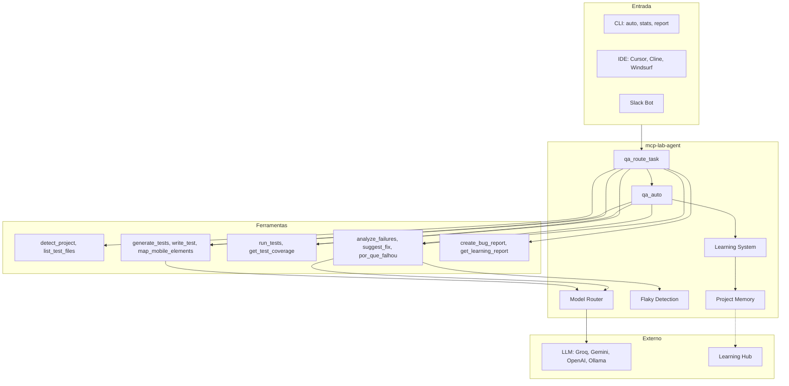
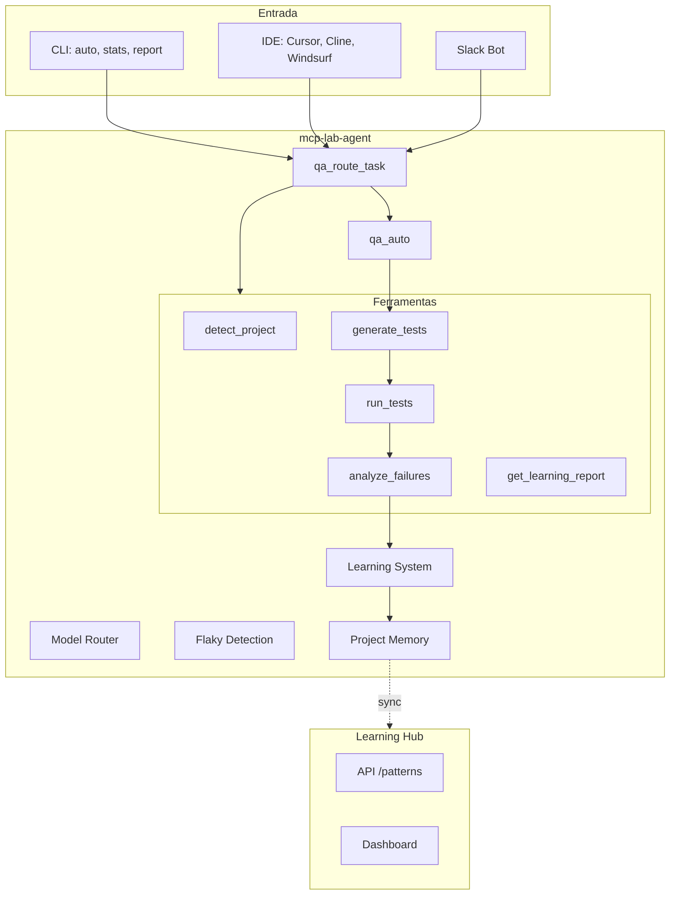

# mcp-lab-agent

[](https://www.npmjs.com/package/mcp-lab-agent)
[](https://nodejs.org)
[](LICENSE)

**Agente de QA que executa, analisa e aprende.** Detecta frameworks automaticamente, gera testes com LLM, corrige falhas e acumula conhecimento entre execuções. Integra ao Cursor, Cline, Windsurf ou Slack.

```bash
npx mcp-lab-agent auto "login flow" --max-retries 5
```

**1 comando. Análise completa.**

---

## O que é

O **mcp-lab-agent** não é apenas um executor de testes. É um sistema que combina automação com análise e aprendizado contínuo. Ele entende o seu projeto, identifica frameworks (Cypress, Playwright, Jest, Appium, Robot, pytest e outros), gera testes com base em context e memória, executa, analisa falhas e aplica correções automaticamente. A cada execução, o agente melhora: taxa de sucesso na primeira tentativa tende a subir com o tempo.

Com o **Learning Hub**, os aprendizados podem ser centralizados e agregados entre projetos, permitindo que times e organizações construam uma base de conhecimento em qualidade compartilhada.

---

## Para quem

| Perfil | Benefício |
|--------|-----------|
| **QAs e SDETs** | Geração assistida de testes, análise de falhas com sugestões de correção, detecção de flakiness |
| **Desenvolvedores** | "Por que falhou?", análise de arquivos e métodos, integração direta no IDE |
| **Tech leads** | Visão de risco por área, métricas de estabilidade, relatórios para decisão |
| **Empresas** | Learning Hub centralizado, CI/CD, suporte a Ollama (offline), Slack para QA via chat |

---

## Comparação

| Outras ferramentas | mcp-lab-agent |
|--------------------|---------------|
| Só executam testes | Executa, analisa causa da falha e sugere correção |
| Saída genérica "teste falhou" | Diagnóstico: "login falha 30% das vezes (timing)" |
| Sem visão de risco | Identifica áreas sem testes e classifica risco (alto/médio/baixo) |
| Sem memória entre execuções | Aprende padrões e melhora nas próximas gerações |
| Uma ferramenta por tarefa | Um agente: geração, execução, análise, relatórios, predição |

---

## Quick Start

### CLI — Análise completa

```bash
# Análise completa: executa testes, analisa estabilidade, prevê riscos e recomenda ações
npx mcp-lab-agent analyze

# Modo autônomo: gera, roda, corrige e aprende (até passar ou max_retries)
npx mcp-lab-agent auto "login flow" --max-retries 5

# Métricas de aprendizado e taxa de sucesso
npx mcp-lab-agent stats

# Relatório de evolução com recomendações para aprimorar o código
npx mcp-lab-agent report --full
```

### IDE — Cursor, Cline, Windsurf

Adicione ao `~/.cursor/mcp.json`:

```json
{
  "mcpServers": {
    "qa-lab-agent": {
      "command": "npx",
      "args": ["-y", "mcp-lab-agent@latest"],
      "cwd": "${workspaceFolder}"
    }
  }
}
```

Use no chat: *"Detecte a estrutura do meu projeto"*, *"Gere teste para login"*, *"Por que o teste falhou?"*, *"Avalie http://localhost:3000 no browser"*.

### Slack Bot

```bash
npx mcp-lab-agent slack-bot
```

Funciona em ambiente corporativo (Socket Mode, sem URL pública). Configure `botToken` e `appToken` em `~/.cursor/mcp.json`. Detalhes: [slack-bot/README.md](slack-bot/README.md).

### Learning Hub — Inteligência centralizada

```bash
npx mcp-lab-agent learning-hub
```

API e Dashboard em `http://localhost:3847`. Configure no `.env` do projeto:

```
LEARNING_HUB_URL=http://localhost:3847
LEARNING_HUB_PROJECT_ID=meu-projeto
```

O agente envia learnings automaticamente. O Hub agrega padrões e fornece recomendações. Detalhes: [learning-hub/README.md](learning-hub/README.md).

---

## Arquitetura



**Fluxo `qa_auto`:**
1. Detecta projeto (frameworks, pastas, fluxos)
2. Gera teste com LLM + memória de aprendizados
3. Executa o teste
4. Se falhar: analisa (flaky detection), corrige e tenta novamente
5. Aprende e salva correções na memória
6. Repete até passar ou atingir `max_retries`

### Diagrama (Mermaid)



---

## Capacidades

### Automação e geração

- **Modo autônomo** (`qa_auto`): gera, executa, analisa, corrige e aprende em loop
- **Geração com LLM**: Groq, Gemini, OpenAI ou Ollama (100% offline)
- **Mapeamento mobile** (`map_mobile_elements`): elementos em Appium/Detox
- **Templates**: waits inteligentes e assert final obrigatório em todo teste gerado

### Análise e diagnóstico

- **Detecção de falhas**: timing, selector, element_not_rendered, element_not_visible, element_stale, mobile_mapping_invisible
- **Mensagens contextualizadas**: cada tipo de erro tem explicação e sugestão específica
- **Análise de estabilidade**: taxa de falha por teste, identificação de flaky
- **Predição de flakiness** (`qa_predict_flaky`): risco antes de o problema aparecer
- **Análise de métodos** (`analyze_file_methods`): varredura por método do arquivo

### Relatórios e métricas

- **Bug reports** em Markdown
- **Métricas de negócio** (se `qa-lab-flows.json` configurado)
- **Relatório de evolução** (`get_learning_report`): padrões por tipo, recomendações
- **Benchmark** (`qa_compare_with_industry`): comparação com padrões do mercado

### Memória e Learning Hub

- **Memória local**: `.qa-lab-memory.json` por projeto
- **Learning Hub**: API central (`POST /learning`, `GET /patterns`), Dashboard, sync automático entre projetos

### Frameworks suportados

Cypress, Playwright, WebdriverIO, Jest, Vitest, Mocha, Robot Framework, pytest, Behave, Appium, Detox.

---

## CLI

| Comando | Descrição |
|---------|-----------|
| *(sem args)* | Inicia servidor MCP (modo IDE) |
| `learning-hub` | API + Dashboard (porta 3847) |
| `slack-bot` | Bot Slack (Socket Mode) |
| `analyze` | Análise completa do projeto |
| `auto <descrição> [--max-retries N]` | Modo autônomo (default: 3 tentativas) |
| `stats` | Estatísticas de aprendizado |
| `report [--full]` | Relatório de evolução |
| `detect [--json]` | Detecta frameworks e estrutura |
| `route <tarefa>` | Sugere ferramenta |
| `list` | Lista agentes e ferramentas |

---

## Escalabilidade e uso em produção

- **Multi-projeto**: memória isolada por projeto; Learning Hub para agregação
- **CI/CD**: integração em GitHub Actions, GitLab CI, etc.
- **Métricas exportáveis**: JSON estruturado para dashboards (Grafana, DataDog)
- **Ollama**: uso 100% offline, adequado para ambientes restritivos
- **LLM interno**: suporte a endpoint customizado da empresa

---

## Configuração

### Variáveis de ambiente (opcionais)

| Variável | Uso |
|----------|-----|
| `GROQ_API_KEY` | Groq |
| `GEMINI_API_KEY` | Google Gemini |
| `OPENAI_API_KEY` | OpenAI |
| `OLLAMA_BASE_URL` | Ollama (default: http://localhost:11434) |
| `QA_LAB_LLM_BASE_URL` | LLM customizado (empresa) |
| `QA_LAB_LLM_API_KEY` | API key do LLM |
| `QA_LAB_LLM_SIMPLE` | Modelo para tarefas simples |
| `QA_LAB_LLM_COMPLEX` | Modelo para tarefas complexas |
| `LEARNING_HUB_URL` | URL do Learning Hub |
| `LEARNING_HUB_PROJECT_ID` | ID do projeto no Hub |

### Ollama (offline)

```bash
brew install ollama
ollama pull llama3.1:8b
ollama serve
npx mcp-lab-agent auto "login flow"
```

### Modo browser (Playwright)

```bash
npm install playwright
```

---

## Documentação

- [CHANGELOG.md](CHANGELOG.md) — Histórico de versões
- [slack-bot/README.md](slack-bot/README.md) — Slack Bot
- [learning-hub/README.md](learning-hub/README.md) — Learning Hub

---

## Desenvolvimento

```bash
git clone https://github.com/Wesley-Gomes93/mcp-lab-agent
cd mcp-lab-agent
npm install
npm run build
npm test
```

| Script | Descrição |
|--------|-----------|
| `npm run build` | Build (tsup) |
| `npm test` | Testes (Vitest) |
| `npm run test:coverage` | Cobertura |
| `npm run dev` | Build em watch |

---

## Licença

MIT © Wesley Gomes
